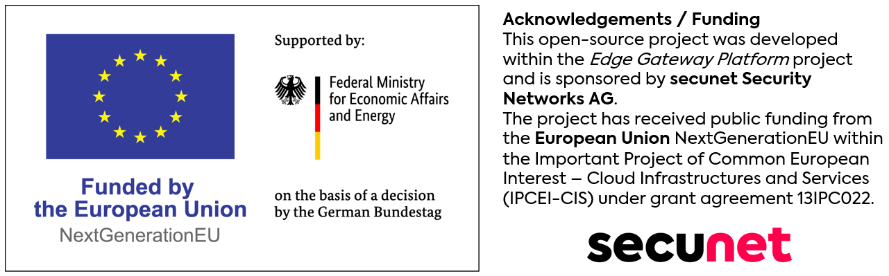

# usbvfiod

**usbvfiod** is a Rust-based tool designed to enable USB device
passthrough to [Cloud
Hypervisor](https://github.com/cloud-hypervisor/cloud-hypervisor)
virtual machines using the [vfio-user
protocol](https://www.qemu.org/docs/master/interop/vfio-user.html). Other
VMMs might also work, but are currently not the main target.

This project is still under active development. We are planning to work on this
project in the following order:

1. **Validating our Assumptions** (Done)
   - We are looking for suitable libraries to use and finalize our design.
1. **Towards USB Storage Passthrough** (Done)
   - We build up a virtual XHCI controller and the necessary plumbing
     to pass-through USB devices from the host.
   - Our initial test target will be USB storage devices.
1. **Broaden Device Support** (Done)
   - We broaden the set of USB devices we support and actively test.
   - Our current focus is enabling USB-2 devices and devices with interrupt
     endpoints.
1. **Hotplug Devices** (Done)
   - We enable attach and detach of exposed devices during runtime.
1. **Stability & Error Recovery** (🚧 **Ongoing** 🚧)
   - We seek out points where we currently panic but should not have to panic.
1. **Everything Beyond**
   - Many topics remain open. We stay flexible regarding upcoming features.

If you want to use this code, please check back later or [get in
touch](https://cyberus-technology.de/en/contact), if you need
professional support.

## Documentation

Find the overview of documentation [here](./docs/overview.md).

## Funding

This project was developed within the *Edge Gateway Platform* project and is sponsored by **secunet Security Networks AG**. 
This project has received public funding from the **European Union** NextGenerationEU within the Important Project of Common European Interest - Cloud Infrastructures and Services (IPCEI-CIS) under grant agreement 13IPC022.

  

