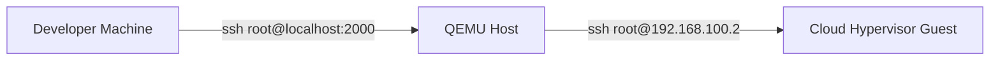

# Overview
> [!NOTE]
A overview about nix vm tests is helpful and can be found here: https://nix.dev/tutorials/nixos/integration-testing-using-virtual-machines.html

The interactive test includes a static port forward to the developers machine port 2000.



## Quick Start
To build and run the interactive vm test (build logs flag is optional):
```
nix run .\#checks.x86_64-linux.integration-smoke.driverInteractive --print-build-logs
```

This will start a python environment where you can run the `test_script()` (or other functions like `start_all()`).

The QEMU will be accessible with:
```
ssh -p 2000 root@localhost -o UserKnownHostsFile=/dev/null -o StrictHostKeyChecking=accept-new
```

Using the QEMU vm as a proxy the nested cloud-hypervisor vm will be accessible with:
```
ssh -o ProxyCommand="ssh -W %h:%p -p 2000 root@localhost -o UserKnownHostsFile=/dev/null -o StrictHostKeyChecking=no" -o UserKnownHostsFile=/dev/null -o StrictHostKeyChecking=no root@192.168.100.2
```