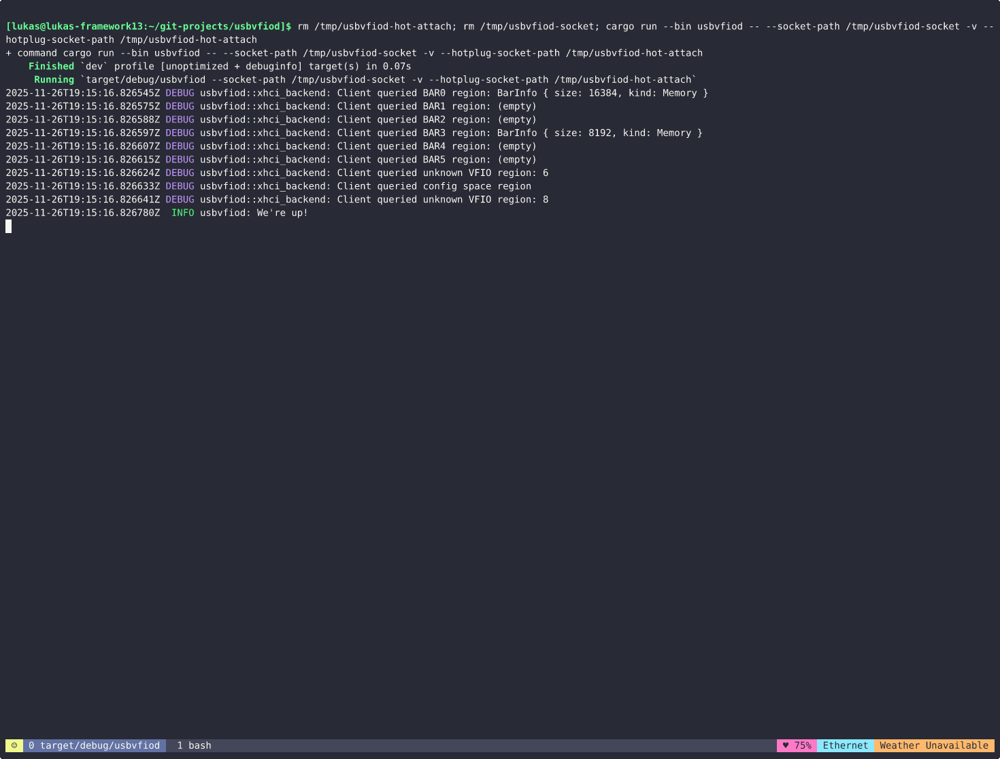

# USB attach/detach Demo with TUI



## Preparations

Get the project and the correct branch, build the binaries.

```
$ git clone git@github.com:cyberus-technology/usbvfiod.git
$ cd usbvfiod
usbvfiod$ git checkout lbeierlieb/detach-async
usbvfiod$ nix develop
usbvfiod$ cargo build --release
```

Clone nixpkgs and build the netboot image if you need an operating system for the Cloud-Hypervisor VM.

```
$ git clone git@github.com:nixos/nixpkgs.git --depth 0
$ cd nixpkgs
nixpkgs$ nix-build ./nixos/release.nix -A netboot.x86_64-linux
```

## Start the demo

Start usbvfiod (no root privileges necessary). The `rm` commands clean up sockets that might remain from previous runs.

```
usbvfiod$ rm /tmp/usbvfiod-hot-attach; rm /tmp/usbvfiod-socket; ./target/release/usbvfiod --socket-path /tmp/usbvfiod-socket --hotplug-socket-path /tmp/usbvfiod-hot-attach
```

Start Cloud-Hypervisor (no privileges necessary). Replace the nix store path for the init parameter with the one you find in `result/netboot.ipxe`.

```
nixpkgs$ cloud-hypervisor --memory size=4G,shared=on --serial tty --user-device socket=/tmp/usbvfiod-socket --console off --kernel result/bzImage --initramfs result/initrd --cmdline "init=/nix/store/kjmds3ywjrakwicygn93ghihr9zqk1nk-nixos-system-nixos-kexec-25.11pre708350.gfedcba/init initrd=initrd nohibernate loglevel=4 console=ttyS0"
```

Start the TUI (needs privileges to open USB device files).

```
usbvfiod$ sudo ./target/release/remote-tui
```

## Demo

In the remote-tui, use up and down arrows to select the desired USB device. Use space to attach a device and escape to detach a device.

### USB stick

- Run `lsusb` and  `lsblk` before to show there are no attached USB devices/storage devices.
- Attach stick with remote-tui.
- Run `lsusb` and  `lsblk`. The drive should show up as /dev/sda.
- Optional: use `while [ 1 ]; do lsusb; lsblk; echo ""; echo ""; sleep 1; done` to see the attachment process without manually typing commands. The `watch` command seems to not work properly on this serial console.
- You can mount and use the USB stick (assuming existence of partition sda1): `mkdir mnt; sudo mount /dev/sda1 mnt;`. Remember to use sudo if you want to create/edit files in the mount. Remember to unmount before detaching the USB stick.
- Measure read through: `sudo dd if=/dev/sda of=/dev/null status=progress bs=4M`

### Mouse/Keyboard

- Run `lsusb` and `ls /dev/input` to show there is no input USB device and only /dev/input/event0 (some virtual powerbutton).
- Attach the input device with remote-tui.
- Run `lsusb` and `ls /dev/input` to show the input USB device and new input device files appeared (dev/input/eventX, perhaps /dev/input/mouse0, /dev/input/mice).
- Run `sudo hexdump -C /dev/input/eventX` (or mouse0) to show when input events arrive.

## Stop the demo

In the Cloud-Hypervisor VM, run the poweroff command. Once Cloud-Hypervisor closes the usbvfiod socket, usbvfiod stops as well.

```
chv-vm > $ sudo poweroff
```

Press 'q' to stop the remote-tui application.
